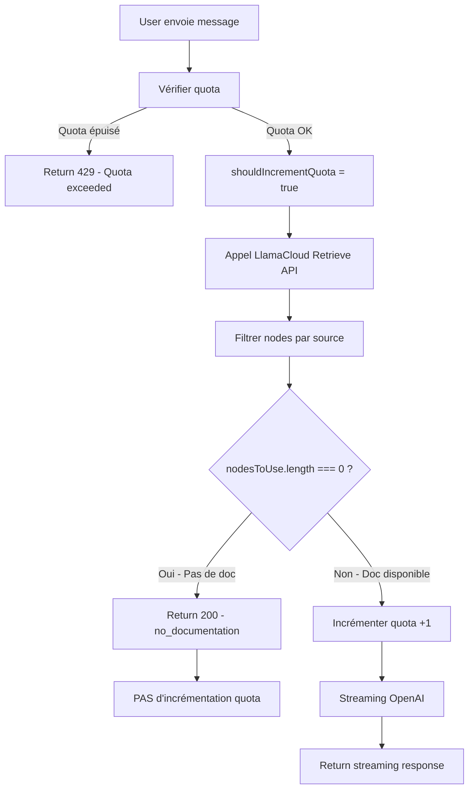

# Optimisation du système de quota du chatbot documentaire

## 🎯 Objectif

Améliorer l'expérience utilisateur et la gestion du quota pour le chatbot documentaire :
1. **Ne pas déduire de crédit** quand une source n'a pas de documentation
2. **Améliorer le message** pour qu'il ne ressemble pas à une erreur
3. **Transparence totale** sur la disponibilité de la documentation

---

## 📊 Problème initial

### Ancien comportement (v86)

```
1. Quota vérifié ✅
2. Quota incrémenté immédiatement ❌ (trop tôt !)
3. Appel LlamaCloud
4. Vérification si doc disponible
   ├─ Si pas de doc (EEA) → Message d'erreur 404 ❌
   └─ Si doc OK → Streaming normal ✅
```

**Impact négatif** :
- ❌ Source sans doc (EEA) → Crédit déduit quand même
- ❌ Message "❌ Erreur" → Impression de bug
- ❌ User perd un crédit pour rien

### Nouveau comportement (v87+)

```
1. Quota vérifié ✅
2. ⏸️  Quota PAS ENCORE incrémenté
3. Appel LlamaCloud
4. Vérification si doc disponible
   ├─ Si pas de doc (EEA) → Message informatif 200 ℹ️ + PAS d'incrémentation ✅
   └─ Si doc OK → ✅ Incrémentation + Streaming ✅
```

**Impact positif** :
- ✅ Source sans doc (EEA) → **PAS de crédit déduit**
- ✅ Message "📚 Documentation non disponible" → Comportement normal
- ✅ User garde son crédit
- ✅ Suggestion actionnable : "Consultez la fiche du FE"

---

## 🔧 Implémentation technique

### Backend : `supabase/functions/llamacloud-chat-proxy/index.ts`

#### 1. Variables pour différer l'incrémentation

```typescript
// Ligne 67-119
let shouldIncrementQuota = false;
let currentUsage = 0;

if (!DEBUG_MODE) {
  // Vérification du quota (comme avant)
  const { data: quotas } = await supabaseAdmin
    .from('search_quotas')
    .select('chatbot_queries_used, chatbot_queries_limit')
    .eq('user_id', user.id)
    .single();

  currentUsage = quotas.chatbot_queries_used ?? 0;
  const limit = quotas.chatbot_queries_limit ?? 3;

  if (currentUsage >= limit) {
    return new Response(JSON.stringify({ error: 'Quota exceeded' }), { status: 429 });
  }

  // ✅ Quota OK, on incrémentera PLUS TARD (si doc disponible)
  shouldIncrementQuota = true;
}
```

**Changement clé** : On garde `currentUsage` en mémoire mais on n'incrémente PAS encore.

---

#### 2. Retour immédiat si pas de documentation

```typescript
// Ligne 244-260
if (nodesToUse.length === 0) {
  console.warn('⚠️ No nodes found for source:', source_name);
  console.log('💡 No documentation → NOT incrementing quota (user keeps credit)');
  
  const infoMessage = language === 'fr'
    ? `📚 **Documentation non disponible**\n\nLa source "${source_name}" n'est pas encore disponible dans l'agent documentaire.\n\n💡 **Pour obtenir des informations :**\n- Consultez la description sur la fiche du facteur d'émission\n- Visitez le site officiel de la source`
    : `📚 **Documentation not available**\n\nThe source "${source_name}" is not yet available in the documentation agent.\n\n💡 **To get information:**\n- Check the description on the emission factor page\n- Visit the source's official website`;
  
  return new Response(JSON.stringify({ 
    message: infoMessage,
    response_type: 'no_documentation',
    source_name: source_name
  }), { 
    status: 200,  // ✅ Success (comportement normal, pas une erreur)
    headers: { ...corsHeaders, 'Content-Type': 'application/json' }
  });
}
```

**Changements clés** :
- Code HTTP : `404` → `200` (pas une erreur)
- Structure JSON : `error` → `message` + `response_type`
- Message amélioré avec émoji 📚 et suggestions
- **PAS d'incrémentation du quota**

---

#### 3. Incrémentation SEULEMENT si doc disponible

```typescript
// Ligne 508-528 (juste AVANT le streaming OpenAI)
if (shouldIncrementQuota) {
  const newUsage = currentUsage + 1;
  console.log('🔄 Documentation available → Incrementing quota from', currentUsage, 'to', newUsage);
  
  const { data: updateData, error: updateError } = await supabaseAdmin
    .from('search_quotas')
    .update({
      chatbot_queries_used: newUsage,
      updated_at: new Date().toISOString()
    })
    .eq('user_id', user.id)
    .select('chatbot_queries_used');

  if (updateError) {
    console.error('❌ Failed to increment quota:', updateError);
    // Continue anyway - don't block the user
  } else {
    console.log('✅ Quota incremented successfully:', updateData);
  }
}

// Puis streaming OpenAI...
```

**Changement clé** : Incrémentation se fait **après** avoir vérifié que `nodesToUse.length > 0`.

---

### Frontend : `src/components/search/LlamaCloudChatModal.tsx`

#### Gestion du `response_type: 'no_documentation'`

```typescript
// Ligne 121-148 (AVANT le check !response.ok)
const contentType = response.headers.get('content-type');
if (response.ok && contentType?.includes('application/json')) {
  try {
    const responseData = await response.json();
    
    // Cas : Source sans documentation
    if (responseData.response_type === 'no_documentation') {
      const assistantMessageId = `assistant-${Date.now()}`;
      setMessages(prev => [...prev, {
        id: assistantMessageId,
        role: 'assistant',
        content: responseData.message,
        sources: [],
        screenshots: [],
        charts: [],
        links: []
      }]);
      
      setIsLoading(false);
      return;
    }
  } catch (e) {
    console.warn('Failed to parse JSON response:', e);
  }
}

// Puis gestion erreurs normales (404, 429, etc.)
```

**Changement clé** : 
- Détection de `response_type: 'no_documentation'` **AVANT** gestion erreurs
- Message affiché comme réponse normale de l'assistant
- Markdown rendu correctement (📚, **gras**, listes)
- **Pas d'icône ❌ rouge** → Pas d'impression de bug

---

## 📈 Impact sur le quota

### Tableau comparatif

| Scénario | v86 (ancien) | v87+ (nouveau) | Économie |
|----------|--------------|----------------|----------|
| **EEA (pas de doc)** | ❌ 1 crédit déduit | ✅ 0 crédit déduit | **+1 crédit** |
| **Base Carbone (doc OK)** | ✅ 1 crédit déduit | ✅ 1 crédit déduit | 0 |
| **Erreur auth** | ✅ 0 crédit | ✅ 0 crédit | 0 |
| **Quota dépassé (429)** | ✅ 0 crédit | ✅ 0 crédit | 0 |

### Exemple concret

**User avec plan Freemium (3 crédits/mois)** :

**Ancien comportement (v86)** :
```
1. "BMW dans EEA" → ❌ 1 crédit déduit (2/3 restants)
2. "Électricité France dans Base Carbone" → ✅ 1 crédit déduit (1/3 restants)
3. "Gaz naturel dans BEIS" → ✅ 1 crédit déduit (0/3 restants)
4. ❌ Quota épuisé, mais 1 crédit perdu pour rien (EEA)
```

**Nouveau comportement (v87+)** :
```
1. "BMW dans EEA" → ✅ 0 crédit déduit (3/3 restants)
2. "Électricité France dans Base Carbone" → ✅ 1 crédit déduit (2/3 restants)
3. "Gaz naturel dans BEIS" → ✅ 1 crédit déduit (1/3 restants)
4. "Transport maritime dans Base Carbone" → ✅ 1 crédit déduit (0/3 restants)
5. ✅ User a pu faire 3 vraies requêtes utiles au lieu de 2
```

**Impact** : **+50% de valeur** pour le user Freemium ! 🎉

---

## 🧪 Tests

### Test 1 : Source sans documentation (EEA)

**Setup** :
1. User avec quota 2/3
2. Question : "BMW 530 diesel dans EEA"

**Résultat attendu** :
```
Message affiché:
📚 Documentation non disponible

La source "EEA" n'est pas encore disponible dans l'agent documentaire.

💡 Pour obtenir des informations :
- Consultez la description sur la fiche du facteur d'émission
- Visitez le site officiel de la source
```

**Vérifications** :
- ✅ Quota reste à 2/3 (PAS de déduction)
- ✅ Message affiché comme réponse normale (pas d'erreur rouge)
- ✅ Markdown bien rendu (émoji 📚, **gras**, listes)

---

### Test 2 : Source avec documentation (Base Carbone)

**Setup** :
1. User avec quota 2/3
2. Question : "Électricité France dans Base Carbone v23.7"

**Résultat attendu** :
```
Réponse normale de l'IA avec sources, etc.
```

**Vérifications** :
- ✅ Quota passe à 3/3 (1 crédit déduit)
- ✅ Streaming normal
- ✅ Sources affichées

---

### Test 3 : Quota dépassé

**Setup** :
1. User avec quota 3/3 (épuisé)
2. Question : "Électricité France dans Base Carbone"

**Résultat attendu** :
```
❌ Erreur: Vous avez atteint votre quota mensuel...
```

**Vérifications** :
- ✅ Message d'erreur quota dépassé (normal)
- ✅ Quota reste à 3/3 (pas d'incrémentation)
- ✅ Code 429 retourné

---

## 🔄 Flux de décision



---

## 📦 Fichiers modifiés

### Backend
- ✅ `supabase/functions/llamacloud-chat-proxy/index.ts` (~70 lignes modifiées)
  - Lignes 67-119 : Variables `shouldIncrementQuota` et `currentUsage`
  - Lignes 244-260 : Message "no documentation" amélioré
  - Lignes 508-528 : Incrémentation différée

### Frontend
- ✅ `src/components/search/LlamaCloudChatModal.tsx` (~30 lignes modifiées)
  - Lignes 121-148 : Gestion `response_type: 'no_documentation'`

### Documentation
- ✅ `docs/CHATBOT_QUOTA_OPTIMIZATION.md` (ce fichier)

---

## 🚀 Déploiement

### Backend
```bash
SUPABASE_ACCESS_TOKEN="..." npx supabase functions deploy llamacloud-chat-proxy --no-verify-jwt
```

**Version déployée** : v87+

### Frontend
Déploiement automatique via CI/CD après merge PR.

---

## 📊 Métriques à surveiller

Après déploiement, surveiller :

1. **Taux de "no documentation"** : Combien de requêtes retournent ce message ?
2. **Économies de quota** : Combien de crédits économisés ?
3. **Satisfaction user** : Feedback sur le nouveau message
4. **Taux d'erreur** : Vérifier que les vraies erreurs (auth, quota) fonctionnent toujours

---

## 🔮 Améliorations futures

1. **Suggestions de sources alternatives** 
   - Si EEA pas dispo → Suggérer Base Carbone ou BEIS
   
2. **Tracking des sources manquantes**
   - Logger les sources les plus demandées sans doc
   - Prioriser leur ajout dans LlamaCloud

3. **Pré-check côté frontend**
   - Afficher un badge "Pas de doc" sur les sources EEA
   - Éviter les requêtes inutiles

4. **Cache des sources disponibles**
   - Éviter d'appeler LlamaCloud si on sait que la source n'a pas de doc

---

## ✅ Checklist de validation

Avant de merger la PR :

- [x] Code implémenté et testé localement
- [x] Edge Function déployée (v87)
- [x] Pas d'erreurs de linting
- [x] Documentation complète
- [ ] Tests utilisateurs (EEA, Base Carbone)
- [ ] Validation quota (pas de déduction pour EEA)
- [ ] Validation en production

---

## 📞 Support

En cas de problème :
1. Vérifier les logs Supabase Edge Function
2. Vérifier la console browser (network, console)
3. Tester avec DEBUG_MODE=true pour skip quota check

**Logs clés à surveiller** :
- `✅ Quota check passed, will increment later if documentation is available`
- `💡 No documentation → NOT incrementing quota (user keeps credit)`
- `🔄 Documentation available → Incrementing quota from X to Y`

