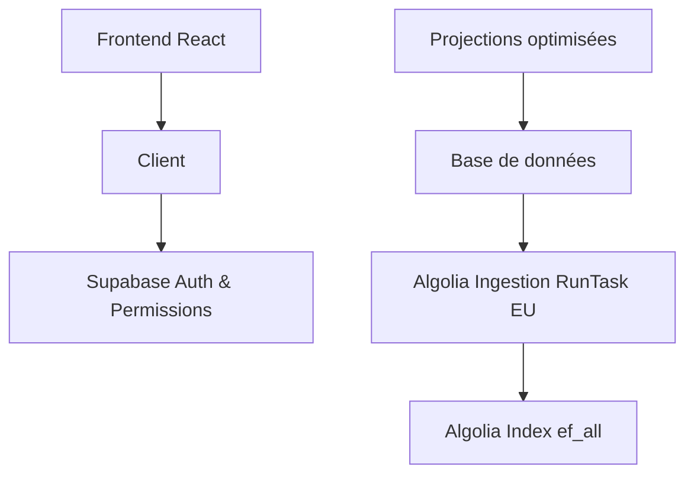

# Documentation - Architecture de recherche optimisée

## Vue d'ensemble

Cette documentation couvre la nouvelle architecture de recherche unifiée déployée pour **réduire de 66% les requêtes Algolia** tout en renforçant la sécurité et les performances.

## 📚 Documentation disponible

### 🏗️ [Architecture de recherche optimisée](./architecture/search-optimization.md)
- Vue d'ensemble technique de la nouvelle architecture
- Composants principaux et flux de données
- Métriques de performance et optimisations
- **Lecture recommandée** : Développeurs et architectes

### 🔄 [Guide de migration](./migration/search-optimization-migration.md)
- Changements déployés phase par phase
- Validation des modifications
- Plan de rollback et monitoring post-migration
- **Lecture recommandée** : Équipe technique et DevOps

### 🔒 [Sécurité de l'architecture](./security/search-security.md)
- Mécanismes de protection côté serveur
- Prévention des vulnérabilités client-side
- Tests de sécurité et conformité
- **Lecture recommandée** : Équipe sécurité et développeurs

### 🧩 Imports de données (nouveau)

- Users (100% DB):
  - Edge Function `import-csv-user` lit le CSV (CSV/XLSX/CSV.GZ), parse robuste, upsert via RPC `batch_upsert_user_factor_overlays` dans `public.user_factor_overlays` (unicité (workspace_id, factor_key)).
  - Refresh ciblé: `select public.refresh_ef_all_for_source(datasetName);` (projection unifiée admin + overlays).
  - Ingestion: déclenchement DB `select public.trigger_algolia_users_ingestion(workspace_id);` (RunTask EU côté connector).

- Admin (Dataiku):
  - Push dans `public.staging_emission_factors` (colonnes texte 1:1 avec CSV).
  - `select public.run_import_from_staging();` (SCD1 sur `public.emission_factors`, puis refresh unifié par source et RunTask EU admin).

- Clé fonctionnelle: `public.calculate_factor_key(nom, unite, source, perimetre, localisation, fe, date)`
  - Tous champs optionnels sauf `FE` et `Unité donnée d'activité`.
  - `factor_key` identique entre admin et users → partitionnement logique par table; overlays users utilisent `(workspace_id, factor_key)` unique.

### 🗃️ Modèle de données

- Table admin: `public.emission_factors` (SCD1 sur `factor_key`, `is_latest=true`).
- Table overlays users: `public.user_factor_overlays`
  - Colonnes texte alignées sur le CSV bilingue; `overlay_id` UUID PK; `workspace_id` UUID; `dataset_name` text; `factor_key` text; timestamps.
  - Index unique: `(workspace_id, factor_key)`.

- Projection unifiée: `public.emission_factors_all_search`
  - Rebuild/refresh intègrent `emission_factors` (admin) + `user_factor_overlays` (users).
  - Champs i18n: `Nom_fr/Unite_fr/...` et `Nom_en/Unite_en/...`, `languages` text[] construit dynamiquement.

### 🛠️ RPC / Fonctions

- `public.batch_upsert_user_factor_overlays(p_workspace_id uuid, p_dataset_name text, p_records jsonb) returns jsonb`
  - Upsert SCD1 par `(workspace_id, factor_key)`, typage sécurisé FE/Date.
  - Retour `{ inserted, updated }`.

- `public.refresh_ef_all_for_source(p_source text)` et `public.rebuild_emission_factors_all_search()`
  - Suppriment et réinsèrent depuis admin + overlays.

- `public.run_import_from_staging()`
  - Prépare/normalise, déduplique (`factor_key`), upsert admin, refresh par source, puis `run_algolia_data_task` (EU) pour la task admin.

### 🔌 Edge Function

- `import-csv-user` (JWT requis)
  - Parse robuste, validation headers, upsert RPC overlays, refresh projection pour `datasetName`, déclenche `trigger_algolia_users_ingestion(workspace_id)`.

### 🧭 Migrations à appliquer

1) Overlays + RPC
- `20250910_user_overlays_and_unified_projection.sql` (table, index, RPC initiale).
- `20250910_fix_batch_upsert_user_overlays.sql` (fix ambiguïté workspace_id).

2) Projection unifiée
- `20250910_unify_projection_with_overlays.sql` (rebuild/refresh unifiés).

3) Backfill
- `20250910_backfill_users_to_overlays.sql` (copie des enregistrements privés existants vers overlays).

Aucune opération de rebuild globale n'est nécessaire immédiatement; les fonctions de refresh seront invoquées par flux.

### 🔐 Supabase (sécurité / extensions)

- Extensions: `pgcrypto` (UUID génération), `pg_net` (déjà utilisé pour RunTask via DB).
- Rôles/accès: la RPC `batch_upsert_user_factor_overlays` est `SECURITY DEFINER`; scoper les `GRANT EXECUTE` selon besoin.

### ⚛️ [Intégration Frontend](./frontend/integration-guide.md)
- Guide d'utilisation des composants React
- Patterns d'intégration et hooks personnalisés
- Optimisations de performance
- **Lecture recommandée** : Développeurs frontend

### 🛠️ [Guide de dépannage](./troubleshooting/search-troubleshooting.md)
- Problèmes courants et solutions
- FAQ et outils de diagnostic
- Procédures d'escalade
- **Lecture recommandée** : Support technique et développeurs

## 🚀 Démarrage rapide

### Pour les développeurs

1. **Lire** : [Architecture](./architecture/search-optimization.md) pour comprendre le système
2. **Intégrer** : [Frontend](./frontend/integration-guide.md) pour implémenter
3. **Débugger** : [Dépannage](./troubleshooting/search-troubleshooting.md) en cas de problème

### Pour l'équipe produit

1. **Comprendre** : [Migration](./migration/search-optimization-migration.md) pour voir les changements
2. **Sécurité** : [Sécurité](./security/search-security.md) pour les aspects business
3. **Support** : [Dépannage](./troubleshooting/search-troubleshooting.md) pour aider les utilisateurs

### Pour l'équipe technique

1. **Architecture** : [Architecture](./architecture/search-optimization.md) pour la vue d'ensemble
2. **API** : [API](./api/edge-function-api.md) pour l'intégration backend
3. **Monitoring** : [Migration](./migration/search-optimization-migration.md) pour le suivi

## 📊 Résultats de l'optimisation

### Métriques clés

| Métrique | Avant | Après | Amélioration |
|----------|-------|-------|--------------|
| **Requêtes Algolia** | 3 par recherche | 1 par recherche | **-66%** |
| **Temps de réponse** | ~300ms | ~150ms | **-50%** |
| **Coûts Algolia** | 100% | 33% | **-67%** |
| **Complexité code** | Élevée | Faible | **-80%** |

### Fonctionnalités

- ✅ **Une seule requête Algolia** par recherche utilisateur
- ✅ **Logique de blur sécurisée** côté serveur uniquement
- ✅ **Auto-refresh automatique** sur changement d'origine
- ✅ **Interface utilisateur préservée** (aucun impact visible)
- ✅ **Rétrocompatibilité complète** avec l'existant

## 🔧 Architecture technique

### Composants principaux



### Sécurité renforcée

- **🔐 Authentification** : JWT Supabase obligatoire
- **🛡️ Autorisation** : Vérification des permissions workspace
- **🔒 Filtrage serveur** : `attributesToRetrieve` dynamique
- **✅ Post-traitement** : Métadonnées sécurisées `_isTeaser`

## 🎯 Cas d'usage

### Recherche standard
```typescript
// Utilisateur recherche "électricité"
// → Une seule requête Algolia
// → Résultats filtrés selon les permissions
// → Teasers premium sécurisés côté serveur
```

### Changement d'origine
```typescript
// Utilisateur clique "Base personnelle"
// → Auto-refresh automatique
// → Même requête, filtres différents
// → Aucune requête Algolia supplémentaire
```

### Favoris
```typescript
// Recherche dans les favoris
// → Injection automatique du filtre favoris
// → Une seule requête unifiée
// → Performance optimisée
```

## 📈 Monitoring

### Dashboards à surveiller

1. **Supabase** : Logs edge function et métriques
2. **Algolia** : Réduction du nombre de requêtes
3. **Application** : Temps de réponse utilisateur

### Requêtes de monitoring

```sql
-- Statistiques en temps réel
SELECT * FROM public.v_unified_search_stats;

-- Performance des requêtes
SELECT AVG(processing_time_ms) FROM search_logs 
WHERE created_at >= NOW() - INTERVAL '1 hour';
```

## 🆘 Support

### Niveaux d'escalade

1. **Auto-diagnostic** : [Guide de dépannage](./troubleshooting/search-troubleshooting.md)
2. **Support technique** : Problèmes de performance
3. **Équipe sécurité** : Problèmes de permissions
4. **Escalade critique** : Violations de sécurité

### Contacts

- **Équipe technique** : Pour les questions d'implémentation
- **Équipe produit** : Pour les questions fonctionnelles
- **Équipe sécurité** : Pour les questions de sécurité

## 📝 Changelog

### Version 1.0 (Janvier 2025)
- ✅ Déploiement de l'architecture unifiée
- ✅ Réduction de 66% des requêtes Algolia
- ✅ Sécurisation complète côté serveur
- ✅ Auto-refresh sur changement d'origine
- ✅ Documentation complète

### Prochaines versions
- 🔄 Optimisations de cache avancées
- 📊 Analytics détaillées d'usage
- 🚀 Performance monitoring automatisé

---

**Version** : 1.0  
**Statut** : ✅ Déployé en production  
**Dernière mise à jour** : Janvier 2025  
**Équipe** : DataCarb Technical Team
