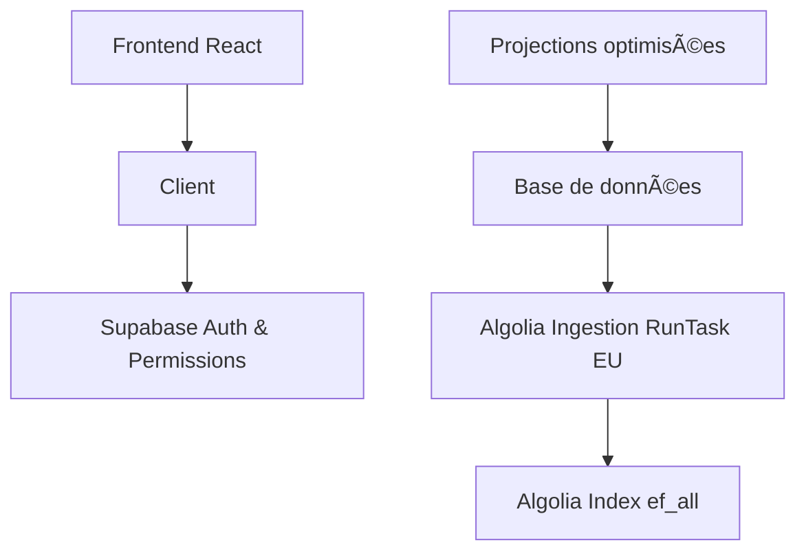

# Documentation - Architecture de recherche optimisée

## Vue d'ensemble

Cette documentation couvre la nouvelle architecture de recherche unifiée déployée pour **réduire de 66% les requêtes Algolia** tout en renforçant la sécurité et les performances.

## 📚 Documentation disponible

### 🏗️ [Architecture de recherche optimisée](./architecture/search-optimization.md)
- Vue d'ensemble technique de la nouvelle architecture
- Composants principaux et flux de données
- Métriques de performance et optimisations
- **Lecture recommandée** : Développeurs et architectes

### 🔄 [Guide de migration](./migration/search-optimization-migration.md)
- Changements déployés phase par phase
- Validation des modifications
- Plan de rollback et monitoring post-migration
- **Lecture recommandée** : Équipe technique et DevOps

### 🔒 [Sécurité de l'architecture](./security/search-security.md)
- Mécanismes de protection côté serveur
- Prévention des vulnérabilités client-side
- Tests de sécurité et conformité
- **Lecture recommandée** : Équipe sécurité et développeurs

### 🔌 Imports de données (nouveau)
- Users: 100% DB → RunTask EU après import
- Admin: Dataiku → run_import_from_staging() → RunTask EU
- Voir README ci‑dessous

### ⚛️ [Intégration Frontend](./frontend/integration-guide.md)
- Guide d'utilisation des composants React
- Patterns d'intégration et hooks personnalisés
- Optimisations de performance
- **Lecture recommandée** : Développeurs frontend

### 🛠️ [Guide de dépannage](./troubleshooting/search-troubleshooting.md)
- Problèmes courants et solutions
- FAQ et outils de diagnostic
- Procédures d'escalade
- **Lecture recommandée** : Support technique et développeurs

## 🚀 Démarrage rapide

### Pour les développeurs

1. **Lire** : [Architecture](./architecture/search-optimization.md) pour comprendre le système
2. **Intégrer** : [Frontend](./frontend/integration-guide.md) pour implémenter
3. **Débugger** : [Dépannage](./troubleshooting/search-troubleshooting.md) en cas de problème

### Pour l'équipe produit

1. **Comprendre** : [Migration](./migration/search-optimization-migration.md) pour voir les changements
2. **Sécurité** : [Sécurité](./security/search-security.md) pour les aspects business
3. **Support** : [Dépannage](./troubleshooting/search-troubleshooting.md) pour aider les utilisateurs

### Pour l'équipe technique

1. **Architecture** : [Architecture](./architecture/search-optimization.md) pour la vue d'ensemble
2. **API** : [API](./api/edge-function-api.md) pour l'intégration backend
3. **Monitoring** : [Migration](./migration/search-optimization-migration.md) pour le suivi

## 📊 Résultats de l'optimisation

### Métriques clés

| Métrique | Avant | Après | Amélioration |
|----------|-------|-------|--------------|
| **Requêtes Algolia** | 3 par recherche | 1 par recherche | **-66%** |
| **Temps de réponse** | ~300ms | ~150ms | **-50%** |
| **Coûts Algolia** | 100% | 33% | **-67%** |
| **Complexité code** | Élevée | Faible | **-80%** |

### Fonctionnalités

- ✅ **Une seule requête Algolia** par recherche utilisateur
- ✅ **Logique de blur sécurisée** côté serveur uniquement
- ✅ **Auto-refresh automatique** sur changement d'origine
- ✅ **Interface utilisateur préservée** (aucun impact visible)
- ✅ **Rétrocompatibilité complète** avec l'existant

## 🔧 Architecture technique

### Composants principaux



### Sécurité renforcée

- **🔐 Authentification** : JWT Supabase obligatoire
- **🛡️ Autorisation** : Vérification des permissions workspace
- **🔒 Filtrage serveur** : `attributesToRetrieve` dynamique
- **✅ Post-traitement** : Métadonnées sécurisées `_isTeaser`

## 🎯 Cas d'usage

### Recherche standard
```typescript
// Utilisateur recherche "électricité"
// → Une seule requête Algolia
// → Résultats filtrés selon les permissions
// → Teasers premium sécurisés côté serveur
```

### Changement d'origine
```typescript
// Utilisateur clique "Base personnelle"
// → Auto-refresh automatique
// → Même requête, filtres différents
// → Aucune requête Algolia supplémentaire
```

### Favoris
```typescript
// Recherche dans les favoris
// → Injection automatique du filtre favoris
// → Une seule requête unifiée
// → Performance optimisée
```

## 📈 Monitoring

### Dashboards à surveiller

1. **Supabase** : Logs edge function et métriques
2. **Algolia** : Réduction du nombre de requêtes
3. **Application** : Temps de réponse utilisateur

### Requêtes de monitoring

```sql
-- Statistiques en temps réel
SELECT * FROM public.v_unified_search_stats;

-- Performance des requêtes
SELECT AVG(processing_time_ms) FROM search_logs 
WHERE created_at >= NOW() - INTERVAL '1 hour';
```

## 🆘 Support

### Niveaux d'escalade

1. **Auto-diagnostic** : [Guide de dépannage](./troubleshooting/search-troubleshooting.md)
2. **Support technique** : Problèmes de performance
3. **Équipe sécurité** : Problèmes de permissions
4. **Escalade critique** : Violations de sécurité

### Contacts

- **Équipe technique** : Pour les questions d'implémentation
- **Équipe produit** : Pour les questions fonctionnelles
- **Équipe sécurité** : Pour les questions de sécurité

## 📝 Changelog

### Version 1.0 (Janvier 2025)
- ✅ Déploiement de l'architecture unifiée
- ✅ Réduction de 66% des requêtes Algolia
- ✅ Sécurisation complète côté serveur
- ✅ Auto-refresh sur changement d'origine
- ✅ Documentation complète

### Prochaines versions
- 🔄 Optimisations de cache avancées
- 📊 Analytics détaillées d'usage
- 🚀 Performance monitoring automatisé

---

**Version** : 1.0  
**Statut** : ✅ Déployé en production  
**Dernière mise à jour** : Janvier 2025  
**Équipe** : DataCarb Technical Team
