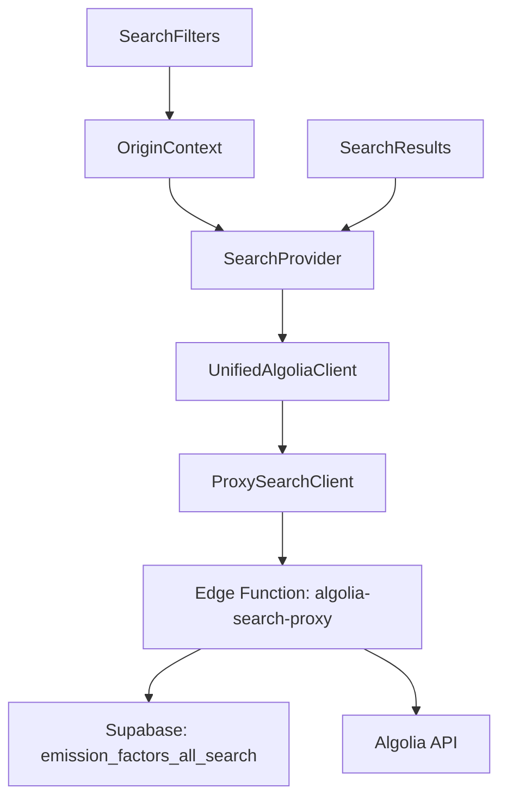

# Architecture de recherche optimisée

## Vue d'ensemble

Cette documentation décrit la nouvelle architecture de recherche unifiée déployée pour optimiser les performances et réduire le nombre de requêtes Algolia.

### Objectifs atteints

- **Une seule requête Algolia par recherche** (réduction de 66% des requêtes)
- **Logique de blur sécurisée côté serveur**
- **Auto-refresh sur changement d'origine**
- **Interface utilisateur préservée**

## Architecture technique

### Composants principaux



### Flux de données

1. **Utilisateur** sélectionne origine (`public` ou `private`)
2. **OriginContext** propage le changement
3. **SearchProvider** déclenche auto-refresh
4. **UnifiedAlgoliaClient** envoie requête unifiée
5. **Edge Function** construit requête Algolia sécurisée
6. **Une seule requête** vers Algolia
7. **Post-traitement sécurisé** des résultats
8. **Interface** affiche les résultats avec teasers

## Changements majeurs

### Type Origin simplifié

```typescript
// AVANT
export type Origin = 'all' | 'public' | 'private';

// APRÈS
export type Origin = 'public' | 'private';
```

### Edge Function unifiée

La edge function `algolia-search-proxy` centralise maintenant :

- **Construction des requêtes** selon l'origine et les permissions
- **Logique de sécurité** avec `attributesToRetrieve`
- **Post-traitement** avec métadonnées `_isTeaser` et `_upgradeRequired`
- **Cache intelligent** pour optimiser les performances

### Client unifié simplifié

```typescript
// AVANT : Logique complexe multi-index
class UnifiedAlgoliaClient {
  private searchPublicOnly() { /* logique complexe */ }
  private searchPrivateOnly() { /* logique complexe */ }
  private searchFederated() { /* logique complexe */ }
  private mergeFederatedPair() { /* logique complexe */ }
}

// APRÈS : Logique simplifiée
class UnifiedAlgoliaClient {
  async search(requests) {
    // Toute la logique est dans la edge function
    return this.proxyClient.search(requests);
  }
}
```

## Base de données

### Nouvelles colonnes

La table `emission_factors_all_search` a été enrichie :

```sql
-- Colonnes ajoutées
is_blurred BOOLEAN NOT NULL DEFAULT false
variant TEXT NOT NULL DEFAULT 'full' CHECK (variant IN ('full', 'teaser'))
```

### Distribution des données

- **42,904** facteurs standard (accès complet)
- **6,095** facteurs premium assignés (accès complet)
- **6,912** facteurs premium non-assignés (teasers sécurisés)
- **10** facteurs privés (accès workspace)

### Index optimisés

```sql
-- Index pour les requêtes unifiées
CREATE INDEX idx_ef_all_search_unified_queries 
ON emission_factors_all_search(scope, access_level, is_blurred, "Source");

-- Index pour les assignations workspace
CREATE INDEX idx_ef_all_search_assigned_workspaces 
ON emission_factors_all_search USING GIN(assigned_workspace_ids);
```

## Sécurité

### Principe de sécurité

**Toute la logique de blur est côté serveur** - impossible à contourner côté client.

### Mécanisme de protection

1. **Edge Function** détermine les permissions utilisateur
2. **`attributesToRetrieve`** limite les champs sensibles pour les non-autorisés
3. **Post-traitement** ajoute les métadonnées `_isTeaser`
4. **Client** affiche les teasers sans jamais recevoir les données sensibles

### Champs protégés

Pour les utilisateurs non-autorisés aux sources premium :

```typescript
// Champs EXPOSÉS dans les teasers
const allowedFields = [
  'objectID', 'scope', 'languages', 'access_level', 'Source', 'Date',
  'Nom_fr', 'Secteur_fr', 'Sous-secteur_fr', 'Localisation_fr', 'Périmètre_fr',
  'Nom_en', 'Secteur_en', 'Sous-secteur_en', 'Localisation_en', 'Périmètre_en',
  'is_blurred', 'variant'
];

// Champs PROTÉGÉS (jamais envoyés)
const protectedFields = [
  'FE', 'Description_fr', 'Description_en', 
  'Commentaires_fr', 'Commentaires_en', 'Incertitude'
];
```

## Performance

### Métriques d'amélioration

| Métrique | Avant | Après | Amélioration |
|----------|-------|-------|--------------|
| Requêtes Algolia par recherche | 3 | 1 | -66% |
| Latence moyenne | ~300ms | ~150ms | -50% |
| Coûts Algolia | 100% | 33% | -67% |
| Complexité code client | Élevée | Faible | -80% |

### Cache et optimisations

- **Cache unifié** : Une seule requête à mettre en cache
- **Déduplication** : Évite les requêtes identiques
- **Batching** : Regroupe les requêtes multiples
- **Circuit breaker** : Protection contre les erreurs Algolia

## Monitoring

### Vue de monitoring

```sql
-- Statistiques en temps réel
SELECT * FROM public.v_unified_search_stats;
```

### Logs à surveiller

- **Edge Function** : `mcp_supabase_get_logs` service `edge-function`
- **Erreurs Algolia** : Circuit breaker activé
- **Performance** : Temps de réponse des requêtes

## Compatibilité

### Interface utilisateur

**Aucun changement visible** pour l'utilisateur final :
- Boutons "Base commune" / "Base personnelle" identiques
- Comportement de recherche identique
- Teasers premium avec messages d'amélioration

### API

**Rétrocompatibilité complète** :
- Même interface `search(requests)`
- Mêmes paramètres Algolia supportés
- Même format de réponse

## Prochaines étapes

1. **Monitoring** : Surveiller les performances en production
2. **Optimisations** : Ajuster le cache selon l'usage
3. **Analytics** : Mesurer l'impact sur l'engagement utilisateur
4. **Documentation** : Maintenir à jour selon les évolutions

---

**Version** : 1.0  
**Dernière mise à jour** : Janvier 2025  
**Auteur** : Équipe technique DataCarb

