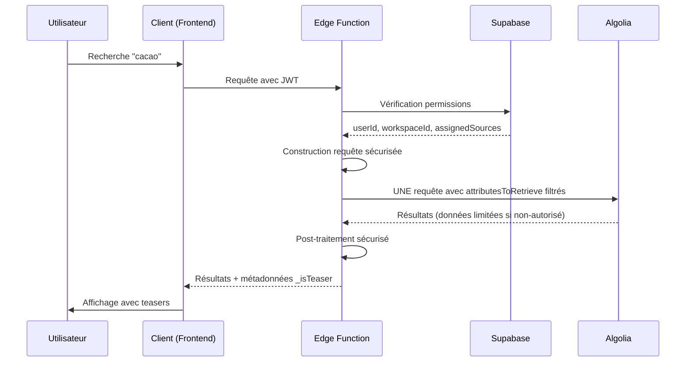

# Sécurité de l'architecture de recherche

## Principe de sécurité fondamental

> **Toute la logique de blur et de permissions est côté serveur**  
> Il est **impossible** pour un utilisateur de contourner les restrictions côté client.

## Architecture sécurisée

### Flux de sécurité



### Points de sécurité critiques

1. **🔐 Authentification JWT** : Vérification côté serveur
2. **🛡️ Permissions dynamiques** : Calculées en temps réel
3. **🔒 Filtrage des attributs** : `attributesToRetrieve` côté serveur
4. **🚫 Aucune donnée sensible** : Jamais envoyée au client non-autorisé

## Mécanismes de protection

### 1. Authentification et autorisation

#### Vérification des permissions

```typescript
// Edge Function - getUserPermissions()
async function getUserPermissions(supabase: any, authHeader: string | null): Promise<UserPermissions> {
  let userId: string | null = null;
  let workspaceId: string | null = null;
  let assignedSources: string[] = [];

  if (authHeader) {
    // 🔐 Vérification JWT Supabase
    const { data: { user }, error: authError } = await supabase.auth.getUser();
    if (!authError && user) {
      userId = user.id;
      
      // 🏢 Récupération du workspace
      const { data: userRow } = await supabase
        .from('users')
        .select('workspace_id')
        .eq('user_id', userId)
        .single();
      workspaceId = userRow?.workspace_id ?? null;
      
      // 📋 Récupération des sources assignées
      if (workspaceId) {
        const { data: assignments } = await supabase
          .from('fe_source_workspace_assignments')
          .select('source_name')
          .eq('workspace_id', workspaceId);
        assignedSources = assignments?.map(a => a.source_name) || [];
      }
    }
  }

  return { userId, workspaceId, assignedSources };
}
```

### 2. Filtrage sécurisé des attributs

#### Logique de protection

```typescript
// Edge Function - buildUnifiedAlgoliaRequest()
const buildUnifiedAlgoliaRequest = (request, permissions, indexName) => {
  let attributesToRetrieve: string[] | undefined = undefined;
  
  if (origin === 'public') {
    if (permissions.workspaceId && permissions.assignedSources.length > 0) {
      // ✅ Workspace avec sources premium assignées
      attributesToRetrieve = undefined; // Tous les attributs
      
    } else {
      // 🚫 Utilisateur sans droits premium
      // SÉCURITÉ : Attributs limités pour les teasers premium
      attributesToRetrieve = [
        'objectID', 'scope', 'languages', 'access_level', 'Source', 'Date',
        'Nom_fr', 'Secteur_fr', 'Sous-secteur_fr', 'Localisation_fr', 'Périmètre_fr',
        'Nom_en', 'Secteur_en', 'Sous-secteur_en', 'Localisation_en', 'Périmètre_en',
        'is_blurred', 'variant'
        // ❌ PAS de FE, Description, Commentaires pour les non-autorisés
      ];
    }
  }
  
  return {
    indexName,
    params: {
      query: query || '',
      facetFilters: unifiedFacetFilters,
      attributesToRetrieve, // 🔒 Filtrage côté serveur
      ...otherParams
    }
  };
};
```

### 3. Champs protégés

#### Classification des données

```typescript
// ✅ CHAMPS PUBLICS (toujours accessibles)
const publicFields = [
  'objectID',
  'scope', 
  'languages',
  'access_level',
  'Source',
  'Date',
  'Nom_fr', 'Nom_en',
  'Secteur_fr', 'Secteur_en',
  'Sous-secteur_fr', 'Sous-secteur_en',
  'Localisation_fr', 'Localisation_en',
  'Périmètre_fr', 'Périmètre_en',
  'is_blurred',
  'variant'
];

// 🔒 CHAMPS PREMIUM (accès restreint)
const premiumFields = [
  'FE',                    // Facteur d'émission
  'Description_fr',        // Description française
  'Description_en',        // Description anglaise
  'Commentaires_fr',       // Commentaires français
  'Commentaires_en',       // Commentaires anglais
  'Incertitude',          // Données d'incertitude
  'Unite_fr', 'Unite_en'  // Unités détaillées
];
```

### 4. Post-traitement sécurisé

#### Ajout de métadonnées

```typescript
// Edge Function - postProcessSecurely()
function postProcessSecurely(result: any, permissions: UserPermissions): any {
  if (!result.hits) return result;
  
  const processedHits = result.hits.map((hit: any) => {
    if (hit.access_level === 'premium' && hit.is_blurred) {
      // 🏷️ Marquer explicitement comme teaser pour le client
      return {
        ...hit,
        _isTeaser: true,           // Indicateur de teaser
        _upgradeRequired: true     // Mise à niveau requise
      };
    }
    return hit;
  });

  return { ...result, hits: processedHits };
}
```

## Modèle de menaces

### Menaces identifiées et mitigations

#### 1. 🎯 Contournement côté client

**Menace** : Utilisateur modifie le code JavaScript pour accéder aux données premium

**Mitigation** :
- ✅ **Filtrage côté serveur** : `attributesToRetrieve` dans la Edge Function
- ✅ **Aucune donnée sensible** : Jamais envoyée au client non-autorisé
- ✅ **Vérification JWT** : Authentification serveur obligatoire

#### 2. 🎯 Manipulation des requêtes

**Menace** : Utilisateur modifie les paramètres de requête pour accéder à plus de données

**Mitigation** :
- ✅ **Validation côté serveur** : Tous les paramètres revalidés
- ✅ **Permissions dynamiques** : Calculées à chaque requête
- ✅ **Facet filters sécurisés** : Construits côté serveur

#### 3. 🎯 Élévation de privilèges

**Menace** : Utilisateur tente d'accéder aux données d'un autre workspace

**Mitigation** :
- ✅ **Isolation par workspace** : `workspace_id` vérifié
- ✅ **Assignations vérifiées** : Sources premium contrôlées
- ✅ **RLS Supabase** : Row Level Security activé

#### 4. 🎯 Attaque par déni de service

**Menace** : Utilisateur génère trop de requêtes pour surcharger le système

**Mitigation** :
- ✅ **Rate limiting** : Limites Supabase Edge Functions
- ✅ **Circuit breaker** : Protection contre les erreurs Algolia
- ✅ **Cache intelligent** : Réduction des requêtes redondantes

## Audit et conformité

### Logs de sécurité

```typescript
// Edge Function - Logging sécurisé
console.log('Unified proxy search', {
  userId: permissions.userId,
  workspaceId: permissions.workspaceId,
  assignedSources: permissions.assignedSources.length,
  origin: request.origin,
  timestamp: Date.now(),
  // ❌ PAS de données sensibles dans les logs
});
```

### Métriques de sécurité

```sql
-- Surveiller les tentatives d'accès
SELECT 
  COUNT(*) as total_requests,
  COUNT(*) FILTER (WHERE is_blurred = true) as teaser_requests,
  COUNT(DISTINCT workspace_id) as unique_workspaces
FROM search_logs 
WHERE created_at > NOW() - INTERVAL '1 day';
```

### Tests de sécurité

#### Tests automatisés

1. **Test d'isolation** : Vérifier qu'un workspace ne peut pas accéder aux données d'un autre
2. **Test de filtrage** : Vérifier que les champs premium ne sont pas exposés
3. **Test d'authentification** : Vérifier que les requêtes non-authentifiées sont rejetées
4. **Test de permissions** : Vérifier que les assignations de sources sont respectées

#### Tests manuels

1. **Inspection réseau** : Vérifier qu'aucune donnée sensible n'est transmise
2. **Test de manipulation** : Tenter de modifier les requêtes côté client
3. **Test de session** : Vérifier l'expiration des tokens JWT

## Bonnes pratiques

### Pour les développeurs

1. **🚫 Jamais de logique de sécurité côté client**
2. **✅ Toujours valider côté serveur**
3. **🔍 Logger les accès sans exposer les données**
4. **🔄 Tester régulièrement les permissions**

### Pour les administrateurs

1. **👥 Gérer les assignations de sources avec parcimonie**
2. **📊 Surveiller les métriques d'accès**
3. **🔔 Configurer des alertes sur les anomalies**
4. **📋 Auditer régulièrement les permissions**

## Incident Response

### En cas de faille de sécurité

1. **🚨 Alerte immédiate** : Notifier l'équipe sécurité
2. **🔒 Isolation** : Désactiver la Edge Function si nécessaire
3. **🔍 Investigation** : Analyser les logs d'accès
4. **🛠️ Correction** : Appliquer le correctif
5. **📊 Post-mortem** : Analyser et améliorer

### Contacts d'urgence

- **Équipe sécurité** : security@ecodex.fr
- **Équipe technique** : tech@ecodex.fr
- **Supabase Support** : Pour les problèmes d'infrastructure

---

**Classification** : Confidentiel  
**Version** : 1.0  
**Dernière révision** : Janvier 2025  
**Prochaine révision** : Avril 2025
