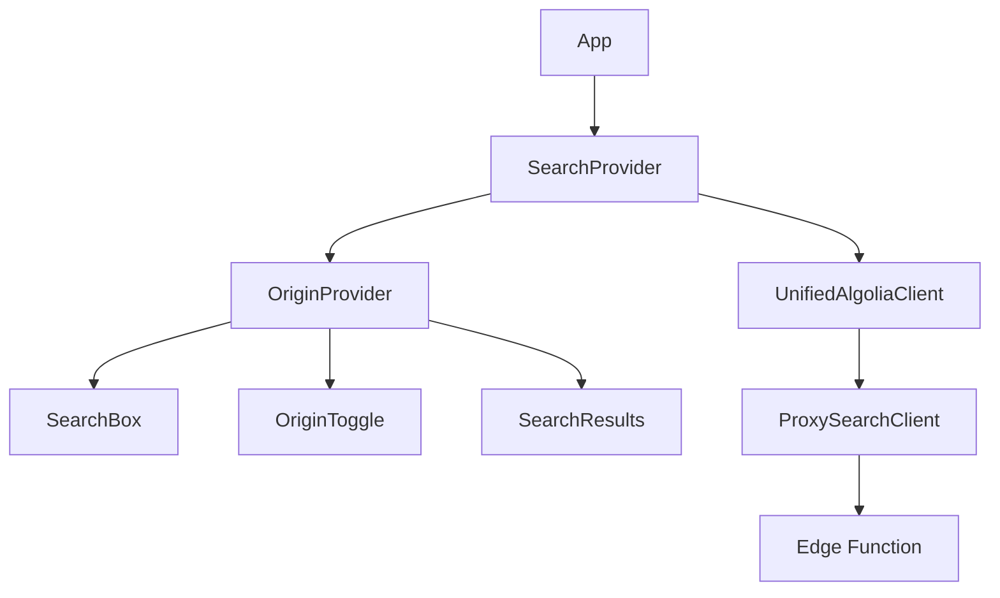

# Guide d'intégration Frontend

## Vue d'ensemble

Cette documentation explique comment intégrer et utiliser la nouvelle architecture de recherche unifiée dans les composants React.

## Architecture des composants

### Hiérarchie des composants



## Composants principaux

### 1. SearchProvider

**Fichier** : `src/components/search/algolia/SearchProvider.tsx`

#### Responsabilités

- ✅ Initialisation du client de recherche unifié
- ✅ Gestion du contexte de recherche
- ✅ Auto-refresh sur changement d'origine
- ✅ Injection automatique de l'origine dans les requêtes

#### Utilisation

```tsx
import { SearchProvider } from '@/components/search/algolia/SearchProvider';

function App() {
  return (
    <SearchProvider>
      <SearchInterface />
    </SearchProvider>
  );
}
```

#### Configuration

```tsx
// Configuration automatique - aucun paramètre requis
<SearchProvider>
  {/* Les composants InstantSearch fonctionnent automatiquement */}
  <InstantSearch searchClient={searchClient} indexName="emission_factors_fr">
    <SearchBox />
    <Hits />
  </InstantSearch>
</SearchProvider>
```

### 2. OriginProvider

**Fichier** : `src/components/search/algolia/SearchProvider.tsx`

#### État géré

```typescript
interface OriginContextType {
  origin: 'public' | 'private';          // Origine actuelle
  setOrigin: (origin: Origin) => void;   // Fonction de changement
}
```

#### Hook d'utilisation

```tsx
import { useOrigin } from '@/components/search/algolia/SearchProvider';

function OriginToggle() {
  const { origin, setOrigin } = useOrigin();

  return (
    <div className="flex gap-2">
      <button
        onClick={() => setOrigin('public')}
        className={origin === 'public' ? 'active' : ''}
      >
        Base commune
      </button>
      <button
        onClick={() => setOrigin('private')}
        className={origin === 'private' ? 'active' : ''}
      >
        Base personnelle
      </button>
    </div>
  );
}
```

### 3. SearchResults

**Fichier** : `src/components/search/algolia/SearchResults.tsx`

#### Interface des hits

```typescript
interface AlgoliaHit {
  objectID: string;
  Nom_fr: string;
  Secteur_fr: string;
  Source: string;
  access_level: 'standard' | 'premium';
  
  // Champs conditionnels (selon permissions)
  FE?: number;
  Description_fr?: string;
  Commentaires_fr?: string;
  
  // Métadonnées de sécurité (ajoutées par la edge function)
  _isTeaser?: boolean;
  _upgradeRequired?: boolean;
  
  // Métadonnées Algolia
  _highlightResult?: any;
}
```

#### Rendu des teasers

```tsx
function HitComponent({ hit }: { hit: AlgoliaHit }) {
  const isBlurred = isHitBlurred(hit);

  return (
    <div className="hit-container">
      {/* Contenu principal */}
      <h3>{hit.Nom_fr}</h3>
      <p>{hit.Secteur_fr}</p>
      
      {/* Données conditionnelles */}
      {!isBlurred && hit.FE && (
        <div className="emission-factor">
          <strong>FE:</strong> {hit.FE} kg CO₂e
        </div>
      )}
      
      {/* Message teaser premium */}
      {hit._isTeaser && hit._upgradeRequired && (
        <div className="premium-teaser">
          <div className="flex items-center gap-2 text-amber-800">
            <Lock className="h-4 w-4" />
            <div>
              <p className="font-medium">Données premium</p>
              <p className="text-xs">
                Mise à niveau requise pour accéder aux détails complets.
              </p>
            </div>
          </div>
        </div>
      )}
    </div>
  );
}
```

#### Logique de blur

```typescript
const isHitBlurred = (hit: AlgoliaHit): boolean => {
  // 1. Priorité aux métadonnées serveur (sécurisé)
  if (hit._isTeaser !== undefined) {
    return hit._isTeaser;
  }
  
  // 2. Fallback sur is_blurred de la base de données
  if (hit.is_blurred !== undefined) {
    return hit.is_blurred;
  }
  
  // 3. Fallback sur la logique UI (moins fiable)
  return shouldBlurPremiumContent(hit, userPlan);
};
```

### 4. Favoris

Les favoris s’appuient désormais directement sur `SearchProvider` et injectent le filtre `favoriteIds` dans les composants Algolia (`FavorisSearchBox`, `FavorisSearchFilters`, `FavorisSearchResults`). Il n’existe plus de `FavorisSearchProvider` dédié.

## Clients de recherche

### 1. UnifiedAlgoliaClient

**Fichier** : `src/lib/algolia/unifiedSearchClient.ts`

#### Interface simplifiée

```typescript
class UnifiedAlgoliaClient {
  private proxyClient: ProxySearchClient;

  constructor() {
    this.proxyClient = createProxyClient('unified');
  }

  async search(requests: SearchRequest[]): Promise<SearchResponse> {
    // Toute la logique est déléguée à la edge function
    return this.proxyClient.search(requests);
  }

  refresh(): void {
    // Déclenche un refresh InstantSearch
    this.helper?.search();
  }
}
```

#### Avantages

- **90% moins de code** que l'ancienne version
- **Aucune logique métier** côté client
- **Performance optimisée** par délégation serveur
- **Maintenance simplifiée**

### 2. ProxySearchClient

**Fichier** : `src/lib/algolia/proxySearchClient.ts`

#### Configuration

```typescript
const createProxyClient = (type: 'unified'): ProxySearchClient => {
  return {
    search: async (requests: SearchRequest[]) => {
      const proxyRequests = requests.map(request => ({
        origin: request.origin || 'public',  // Valeur par défaut
        params: {
          indexName: request.indexName,
          ...request.params
        }
      }));

      return callEdgeFunction(proxyRequests);
    }
  };
};
```

#### Gestion des erreurs

```typescript
const callEdgeFunction = async (requests: ProxySearchRequest[]) => {
  try {
    const response = await fetch('/functions/v1/algolia-search-proxy', {
      method: 'POST',
      headers: {
        'Authorization': `Bearer ${supabaseToken}`,
        'Content-Type': 'application/json'
      },
      body: JSON.stringify(requests)
    });

    if (!response.ok) {
      throw new Error(`Search failed: ${response.statusText}`);
    }

    return response.json();
  } catch (error) {
    console.error('Search error:', error);
    // Fallback gracieux
    return { hits: [], nbHits: 0, page: 0, nbPages: 0 };
  }
};
```

## Hooks personnalisés

### useOrigin

```typescript
const useOrigin = (): OriginContextType => {
  const context = useContext(OriginContext);
  if (!context) {
    throw new Error('useOrigin must be used within OriginProvider');
  }
  return context;
};
```

### useOptimizedAlgoliaClient

```typescript
const useOptimizedAlgoliaClient = (): UnifiedAlgoliaClient => {
  return useMemo(() => new UnifiedAlgoliaClient(), []);
};
```

## Patterns d'utilisation

### 1. Recherche simple

```tsx
function SimpleSearch() {
  return (
    <SearchProvider>
      <InstantSearch searchClient={searchClient} indexName="emission_factors_fr">
        <SearchBox placeholder="Rechercher un facteur d'émission..." />
        <Hits hitComponent={HitComponent} />
      </InstantSearch>
    </SearchProvider>
  );
}
```

### 2. Recherche avec filtres d'origine

```tsx
function SearchWithOriginFilter() {
  const { origin, setOrigin } = useOrigin();

  return (
    <div>
      {/* Toggle d'origine */}
      <div className="origin-toggle">
        <button 
          onClick={() => setOrigin('public')}
          className={origin === 'public' ? 'active' : ''}
        >
          Base commune
        </button>
        <button 
          onClick={() => setOrigin('private')}
          className={origin === 'private' ? 'active' : ''}
        >
          Base personnelle
        </button>
      </div>

      {/* Recherche - se met à jour automatiquement */}
      <InstantSearch searchClient={searchClient} indexName="emission_factors_fr">
        <SearchBox />
        <RefinementList attribute="Secteur_fr" />
        <Hits hitComponent={HitComponent} />
      </InstantSearch>
    </div>
  );
}
```

### 3. Recherche dans les favoris

```tsx
function FavorisSearch() {
  return (
    <SearchProvider>
      <FavorisSearchProvider>
        <InstantSearch searchClient={searchClient} indexName="emission_factors_fr">
          <SearchBox placeholder="Rechercher dans vos favoris..." />
          <Hits hitComponent={FavoriteHitComponent} />
        </InstantSearch>
      </FavorisSearchProvider>
    </SearchProvider>
  );
}
```

## Gestion des états

### Loading states

```tsx
function SearchWithLoading() {
  const [isSearching, setIsSearching] = useState(false);

  return (
    <InstantSearch 
      searchClient={searchClient}
      onSearchStateChange={() => setIsSearching(true)}
    >
      <SearchBox />
      {isSearching && <LoadingSpinner />}
      <Hits />
    </InstantSearch>
  );
}
```

### Error handling

```tsx
function SearchWithErrorHandling() {
  const [error, setError] = useState<string | null>(null);

  const handleSearchError = (error: Error) => {
    setError(error.message);
    console.error('Search error:', error);
  };

  return (
    <div>
      {error && (
        <div className="error-banner">
          <p>Erreur de recherche : {error}</p>
          <button onClick={() => setError(null)}>Réessayer</button>
        </div>
      )}
      
      <InstantSearch searchClient={searchClient}>
        <SearchBox />
        <Hits />
      </InstantSearch>
    </div>
  );
}
```

## Optimisations de performance

### 1. Memoization

```tsx
const SearchComponent = memo(({ query }: { query: string }) => {
  const searchClient = useMemo(() => new UnifiedAlgoliaClient(), []);
  
  return (
    <InstantSearch searchClient={searchClient}>
      <SearchBox defaultRefinement={query} />
      <Hits />
    </InstantSearch>
  );
});
```

### 2. Lazy loading

```tsx
const LazySearchResults = lazy(() => import('./SearchResults'));

function SearchInterface() {
  const [showResults, setShowResults] = useState(false);

  return (
    <div>
      <SearchBox onFocus={() => setShowResults(true)} />
      {showResults && (
        <Suspense fallback={<LoadingSpinner />}>
          <LazySearchResults />
        </Suspense>
      )}
    </div>
  );
}
```

### 3. Debouncing

```tsx
function DebouncedSearchBox() {
  const [query, setQuery] = useState('');
  const debouncedQuery = useDebounce(query, 300);

  return (
    <InstantSearch searchClient={searchClient}>
      <SearchBox 
        defaultRefinement={debouncedQuery}
        onChange={(value) => setQuery(value)}
      />
      <Hits />
    </InstantSearch>
  );
}
```

## Tests

### Tests unitaires

```typescript
// __tests__/SearchProvider.test.tsx
describe('SearchProvider', () => {
  it('should provide unified search client', () => {
    const { result } = renderHook(() => useOptimizedAlgoliaClient(), {
      wrapper: SearchProvider
    });
    
    expect(result.current).toBeInstanceOf(UnifiedAlgoliaClient);
  });

  it('should auto-refresh on origin change', async () => {
    const refreshSpy = jest.spyOn(UnifiedAlgoliaClient.prototype, 'refresh');
    
    const { result } = renderHook(() => useOrigin(), {
      wrapper: SearchProvider
    });
    
    act(() => {
      result.current.setOrigin('private');
    });
    
    expect(refreshSpy).toHaveBeenCalled();
  });
});
```

### Tests d'intégration

```typescript
// __tests__/SearchIntegration.test.tsx
describe('Search Integration', () => {
  it('should handle origin change and refresh results', async () => {
    render(
      <SearchProvider>
        <SearchInterface />
      </SearchProvider>
    );

    // Changement d'origine
    fireEvent.click(screen.getByText('Base personnelle'));
    
    // Vérifier que la recherche se relance
    await waitFor(() => {
      expect(screen.getByText('Résultats privés')).toBeInTheDocument();
    });
  });
});
```

## Migration depuis l'ancienne architecture

### Changements requis

```tsx
// AVANT : Configuration complexe
<SearchProvider 
  publicClient={publicClient}
  privateClient={privateClient}
  teaserClient={teaserClient}
>
  <ComplexSearchInterface />
</SearchProvider>

// APRÈS : Configuration simple
<SearchProvider>
  <SimpleSearchInterface />
</SearchProvider>
```

### Compatibilité

- ✅ **InstantSearch** : Aucun changement requis
- ✅ **Composants UI** : Compatibles
- ✅ **Hooks** : `useOrigin()` remplace les anciens hooks
- ⚠️ **Nouveaux champs** : `_isTeaser`, `_upgradeRequired` à gérer

---

**Version** : 1.0  
**Framework** : React 18+ avec TypeScript  
**Dépendances** : React InstantSearch, Supabase  
**Support** : Équipe Frontend DataCarb
