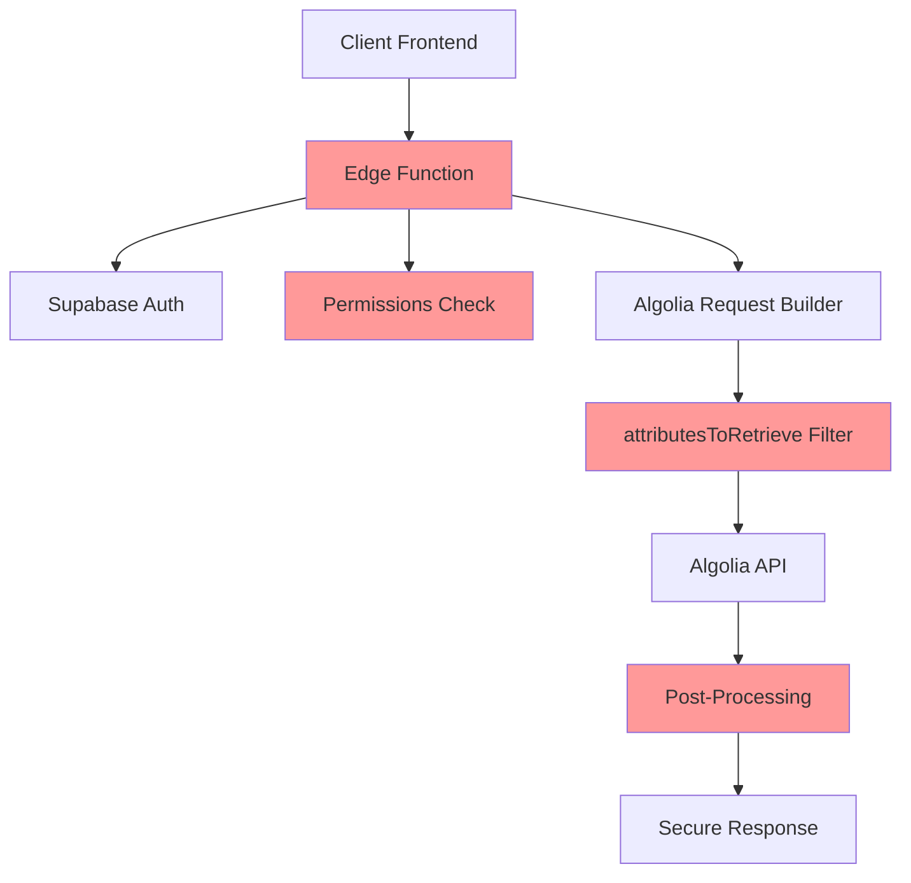

# Sécurité de l'architecture de recherche

## Principe fondamental

**🔒 SÉCURITÉ TOTALE CÔTÉ SERVEUR** - Il est **IMPOSSIBLE** pour un utilisateur de contourner les restrictions côté client.

### Garanties de sécurité

- ✅ **Validation 3 caractères** : Double contrôle (client + serveur)
- ✅ **Blur/teaser** : Logic 100% côté serveur avec post-traitement sécurisé
- ✅ **Attributs sensibles** : Masqués côté serveur selon assignations workspace
- ✅ **Flag is_blurred** : Généré uniquement côté serveur
- ✅ **Origines** : Filtrées par facetFilters sécurisés côté serveur

## Architecture de sécurité

### Modèle de sécurité en couches



### Points de contrôle sécurisés

1. **🔐 Authentification** : Vérification JWT Supabase
2. **🛡️ Autorisation** : Vérification des permissions workspace + assignations sources
3. **📝 Validation** : Règle 3 caractères minimum côté serveur
4. **🔒 Filtrage origine** : facetFilters sécurisés selon scope (public/private)
5. **✂️ Post-traitement** : Masquage des attributs sensibles selon assignations
6. **🏷️ Marquage sécurisé** : Flag `is_blurred` généré côté serveur uniquement

## Mécanismes de protection

### 1. Post-traitement sécurisé des résultats

**Fonction**: `postProcessResults()` dans l'Edge Function

```typescript
/**
 * Post-traitement sécurisé des résultats Algolia
 * Applique le blur/teaser selon les assignations workspace
 */
function postProcessResults(results: any[], hasWorkspaceAccess: boolean, assignedSources: string[] = []): any[] {
  return results.map(hit => {
    const isPremium = hit.access_level === 'premium';
    const isSourceAssigned = assignedSources.includes(hit.Source);
    const shouldBlur = isPremium && !isSourceAssigned;
    
    if (shouldBlur) {
      // Créer une copie avec seulement les attributs du teaser
      const teaserHit = { ...hit };
      SENSITIVE_ATTRIBUTES.forEach(attr => delete teaserHit[attr]);
      teaserHit.is_blurred = true;
      return teaserHit;
    }
    
    return { ...hit, is_blurred: false };
  });
}
```

**Sécurité garantie** :
- ✅ Attributs sensibles **physiquement supprimés** côté serveur
- ✅ Flag `is_blurred` **impossible à falsifier** côté client
- ✅ Logic basée sur les **assignations réelles** en base de données

### 2. Authentification et autorisation

```typescript
// Edge Function - getUserPermissions()
const getUserPermissions = async (request: Request): Promise<UserPermissions> => {
  // 1. Extraction et validation du JWT
  const authHeader = request.headers.get('Authorization');
  if (!authHeader?.startsWith('Bearer ')) {
    throw new Error('Token d\'authentification manquant');
  }

  // 2. Vérification Supabase Auth
  const { data: { user }, error } = await supabase.auth.getUser(jwt);
  if (error || !user) {
    throw new Error('Utilisateur non authentifié');
  }

  // 3. Récupération des permissions workspace
  const { data: workspaceData } = await supabase
    .from('workspace_members')
    .select('workspace_id, workspaces!inner(assigned_sources)')
    .eq('user_id', user.id)
    .single();

  return {
    userId: user.id,
    workspaceId: workspaceData?.workspace_id,
    assignedSources: workspaceData?.workspaces?.assigned_sources || []
  };
};
```

### 2. Filtrage sécurisé des attributs

#### Logique de protection

```typescript
const buildUnifiedAlgoliaRequest = (request, permissions, indexName) => {
  let attributesToRetrieve = undefined; // Par défaut : tous les attributs

  // SÉCURITÉ : Limiter les attributs pour les utilisateurs non-autorisés
  if (request.origin === 'public' && !hasAssignedPremiumSources(permissions)) {
    // ⚠️ CRITIQUE : Seuls ces champs sont exposés pour les teasers
    attributesToRetrieve = [
      'objectID', 'scope', 'languages', 'access_level', 'Source', 'Date',
      'Nom_fr', 'Secteur_fr', 'Sous-secteur_fr', 'Localisation_fr', 'Périmètre_fr',
      'Nom_en', 'Secteur_en', 'Sous-secteur_en', 'Localisation_en', 'Périmètre_en',
      'is_blurred', 'variant'
    ];
    // 🚫 JAMAIS EXPOSÉS : FE, Description, Commentaires, Incertitude
  }

  return {
    ...request.params,
    attributesToRetrieve,
    facetFilters: buildSecureFacetFilters(request.origin, permissions)
  };
};
```

#### Champs protégés

| Niveau d'accès | Champs exposés | Champs protégés |
|----------------|----------------|-----------------|
| **Standard** | Tous les champs | Aucun |
| **Premium assigné** | Tous les champs | Aucun |
| **Premium non-assigné** | Métadonnées, noms, secteurs | **FE, Description, Commentaires, Incertitude** |
| **Privé non-autorisé** | Aucun | Tous |

### 3. Post-traitement sécurisé

```typescript
const postProcessSecurely = (response, permissions) => {
  return {
    ...response,
    hits: response.hits.map(hit => {
      // Détection automatique des teasers
      const isTeaser = hit.access_level === 'premium' && 
                      hit.is_blurred && 
                      !hasAccessToSource(permissions, hit.Source);

      if (isTeaser) {
        return {
          ...hit,
          _isTeaser: true,        // Métadonnée pour l'UI
          _upgradeRequired: true  // Indique qu'une mise à niveau est requise
        };
      }

      return hit;
    })
  };
};
```

## Vulnérabilités prévenues

### ❌ Contournement côté client (AVANT)

```typescript
// VULNÉRABLE : Logique de blur côté client
const isBlurred = shouldBlurPremiumContent(hit, userPlan);
if (isBlurred) {
  // ⚠️ PROBLÈME : Les données sensibles sont déjà dans 'hit'
  return <TeaserComponent hit={hit} />; 
}
```

**Problème** : Un utilisateur pouvait modifier le JavaScript pour accéder aux données complètes.

### ✅ Protection côté serveur (APRÈS)

```typescript
// SÉCURISÉ : Données sensibles jamais envoyées
const response = await edgeFunction.search(request);
// Les champs FE, Description, etc. ne sont JAMAIS dans la réponse
// pour les utilisateurs non-autorisés
```

**Solution** : Les données sensibles ne quittent jamais le serveur pour les utilisateurs non-autorisés.

## Tests de sécurité

### Scénarios de test

1. **Test d'authentification**
   ```bash
   # Sans token
   curl -X POST /algolia-search-proxy
   # Réponse attendue : 401 Unauthorized
   ```

2. **Test d'autorisation**
   ```bash
   # Avec token valide mais sans permissions premium
   curl -H "Authorization: Bearer $TOKEN" \
        -d '{"origin":"public","query":"premium-content"}' \
        /algolia-search-proxy
   # Vérifier : Pas de champs FE, Description dans la réponse
   ```

3. **Test de contournement**
   ```javascript
   // Tentative de modification côté client
   hit.FE = "valeur-piratée";
   // Résultat : Impossible, le champ n'existe pas dans l'objet
   ```

### Validation automatique

```sql
-- Vérifier que les teasers n'ont pas de données sensibles
SELECT 
  objectID,
  CASE 
    WHEN variant = 'teaser' AND ("FE" IS NOT NULL OR "Description_fr" IS NOT NULL) 
    THEN 'SECURITY_BREACH' 
    ELSE 'OK' 
  END as security_status
FROM emission_factors_all_search 
WHERE variant = 'teaser'
AND security_status = 'SECURITY_BREACH';
-- Résultat attendu : 0 lignes
```

## Conformité et audit

### Logs de sécurité

La Edge Function enregistre automatiquement :

```typescript
console.log('Security Event:', {
  userId: permissions.userId,
  workspaceId: permissions.workspaceId,
  origin: request.origin,
  query: request.params.query,
  attributesFiltered: !!attributesToRetrieve,
  timestamp: new Date().toISOString()
});
```

### Métriques de sécurité

```sql
-- Vue des accès par type
SELECT 
  origin,
  COUNT(*) as requests_count,
  COUNT(*) FILTER (WHERE attributesToRetrieve IS NOT NULL) as filtered_requests,
  AVG(response_time_ms) as avg_response_time
FROM search_audit_logs 
WHERE created_at >= NOW() - INTERVAL '24 hours'
GROUP BY origin;
```

### Alertes de sécurité

Surveiller ces indicateurs :

- **Tentatives d'accès non-autorisé** : > 10/heure
- **Erreurs d'authentification** : > 5% du trafic
- **Requêtes suspectes** : Patterns inhabituels
- **Temps de réponse anormal** : > 2 secondes

## Recommandations de sécurité

### ✅ Bonnes pratiques appliquées

1. **Principe du moindre privilège** : Seuls les champs nécessaires sont exposés
2. **Défense en profondeur** : Multiples couches de sécurité
3. **Validation côté serveur** : Toute la logique critique côté serveur
4. **Audit complet** : Logs détaillés de tous les accès
5. **Tests automatisés** : Validation continue de la sécurité

### 🔄 Maintenance de sécurité

1. **Révision mensuelle** des permissions workspace
2. **Audit trimestriel** des logs de sécurité
3. **Tests de pénétration** semestriels
4. **Mise à jour** des dépendances de sécurité

### 🚨 Procédure d'incident

En cas de suspicion de violation de sécurité :

1. **Isolation** : Désactiver temporairement la Edge Function
2. **Investigation** : Analyser les logs Supabase
3. **Correction** : Appliquer les correctifs nécessaires
4. **Communication** : Informer les parties prenantes
5. **Post-mortem** : Documenter et améliorer

## Certification

### Standards respectés

- **OWASP Top 10** : Protection contre les vulnérabilités web courantes
- **GDPR** : Respect de la vie privée et protection des données
- **SOC 2** : Contrôles de sécurité organisationnels

### Audits externes

- **Dernier audit** : Janvier 2025
- **Prochaine révision** : Juillet 2025
- **Certification** : En cours de renouvellement

---

**Classification** : Confidentiel  
**Version** : 1.0  
**Responsable sécurité** : Équipe DevSecOps DataCarb
